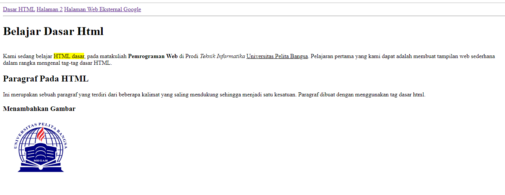

File Jawaban Essay Ada Pada folder berikut:
- https://github.com/Reizen-production/Lab1Web/blob/main/Tugas2_web_311910610_ArioFajar.pdf
# Lab1Web

# Praktikum1 Html Menggunakan VSC
1. Membuat Paragraf
- Berikut adalah source code nya:
- 
- Kemudian Ini adalah Outputnya:
- 
- Muncul isi paragraf yang bisa kita isi sesuai keinginan kita, pastikan mengisi pada bagian <body></body>
2. Setelah Itu Kita Coba Tambahkan Atribut
- Berikut adalah source code nya:
- 
- Kemudian Ini adalah Outputnya:
- 
- Berikut adalah atribut lainnya selain contoh diatas, (align => justify, left, right, dan center) dapat dicoba untuk diubah ubah.
3. Setelah itu kita akan menambahkan header/judul
- Berikut adalah source code nya:
- 
- Kemudian Ini adalah Outputnya: 
- 
- Header muncul dengan atribut <h> </h>
4. Memformat Teks
- Berikut adalah source code nya:
- 
- Kemudian Ini adalah Outputnya: 
- 
- Banyak sekali format dalam teks, contoh diatas hanyalah beberapa, contoh tag lain bisa dicari di google.
5. Menambahkan Gambar
- Berikut adalah source code nya:
- 
- Kemudian Ini adalah Outputnya: 
- 
- Gambar yang di pilih bisa disesuaikan dengan width dan height agar lebih proporsional sesuai keinginan.
- Berikut contohnya setelah di atur width dan height nya : 
- 
6. Menambahkan Hyperlink
- Berikut adalah source code nya:
- 
- Kemudian Ini adalah Outputnya: 
- 
- ada menu di atas yang bisa kita pilih dan atur sesuka kita, hyperlink menghubungkan 1 html dengan html lainnya.
- kita akan coba klik Halaman 2 dan inilah yang terjadi : 
- 
- itu adalah yang terjadi saat tujuan yang kita tuju tidak ada, oleh karena itu kita akan membuat halaman tujuannya, kita bisa copy paste seperti apa yang kita kerjakan diatas atau kita bisa membuat hal baru sebagai contoh, ini yang saya buat :
- 
- Source code yang digunakan sama, hanya mengubah kata kata dan gambarnya saja.
#Sekian Adalah Praktikum HTML Sederhana Dari Saya
